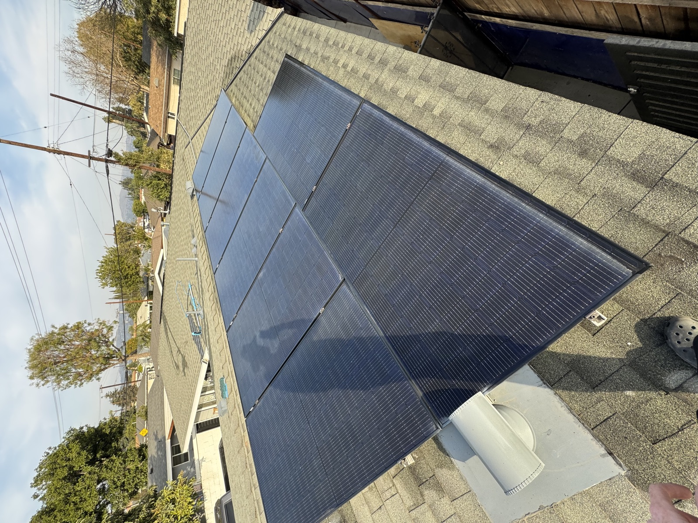

# Image & Video Optimization Report — Innovative Repairs

Generated: 2026-04-28
Scope: `assets/` only. No `.html`, `.css`, `.js`, or `.htaccess` files were modified.

---

## Executive summary

| Metric | Value |
|---|---|
| Image files in scope | 39 |
| New WebP files generated | 40 (one per image, including the orphans + logo) |
| Original image bytes (pre-optimization) | 40,373,707 B (~38.50 MiB) |
| Delivered image bytes (WebP, when supported) | 7,302,422 B (~6.96 MiB) |
| **Total image bytes saved (when WebP is served)** | **33,071,285 B (~31.54 MiB)** |
| JPEG fallback bytes (after destructive in-place resize) | ~17.40 MiB total — about 21 MiB lighter than originals |
| Videos optimized | 0 (ffmpeg not installed — manual commands documented below) |
| `assets/` directory size | 60 MB → 47 MB after this pass; once videos are re-encoded the directory should drop another ~17 MB → ~30 MB. |

WebP quality is **80** for every image. Sharp's `--fit inside --withoutEnlargement` was used so small thumbnails were never upscaled.

---

## Per-file results

Format-only conversion = original kept at native dimensions, WebP generated alongside.
"Resized in place" = original JPEG/PNG was destructively overwritten at a smaller dimension. **There are no `.original` backups.**

| File | Orig size | Orig dims | New JPEG/PNG size | New JPEG/PNG dims | WebP size | WebP dims | Bytes saved (WebP) |
|---|---:|---|---:|---|---:|---|---:|
| `1709037C-FC83-437E-89CA-4A1CD9C0E64F.jpeg` | 89,069 | 741×720 | 89,069 (untouched) | 741×720 | 12,054 | 741×720 | 77,015 |
| `Edits-12.jpg` | 320,296 | 2880×1921 | 320,296 (untouched) | 2880×1921 | 76,014 | 1280×854 | 244,282 |
| `Edits-15.jpg` | 312,536 | 2880×1921 | 312,536 (untouched) | 2880×1921 | 143,974 | 1920×1281 | 168,562 |
| `Edits-23.jpg` | 318,807 | 2880×1921 | 318,807 (untouched) | 2880×1921 | 69,506 | 1280×854 | 249,301 |
| `Edits-34.jpg` | 207,354 | 2880×1921 | 207,354 (untouched) | 2880×1921 | 42,302 | 1280×854 | 165,052 |
| `Electric-pannel.jpeg` | 44,414 | 360×480 | 44,414 (untouched) | 360×480 | 17,024 | 360×480 | 27,390 |
| `Fireplace.jpeg` | 49,695 | 360×480 | 49,695 (untouched) | 360×480 | 20,864 | 360×480 | 28,831 |
| `FullSizeRender.jpeg` | 1,393,168 | 3024×4032 | **820,305 (resized in place)** | **1200×1600** | 475,912 | 1200×1600 | 917,256 |
| `Glass-Bathroom.jpeg` | 46,482 | 360×480 | 46,482 (untouched) | 360×480 | 18,070 | 360×480 | 28,412 |
| `Grey-Bathroom.jpeg` | 29,403 | 360×480 | 29,403 (untouched) | 360×480 | 9,922 | 360×480 | 19,481 |
| `IMG_1913.jpeg` | 1,583,579 | 3024×4032 | **839,703 (resized in place)** | **1200×1600** | 500,552 | 1200×1600 | 1,083,027 |
| `IMG_2168.jpeg` | 5,922,594 | 4032×3024 | **913,171 (resized in place)** | **1600×1200** | 513,904 | 1600×1200 | 5,408,690 |
| `IMG_2978.jpeg` | 1,318,698 | 3024×4032 | **724,393 (resized in place)** | **1200×1600** | 402,850 | 1200×1600 | 915,848 |
| `IMG_3533.jpeg` | 622,503 | 3024×4032 | 622,503 (untouched) | 3024×4032 | 120,250 | 1200×1600 | 502,253 |
| `IMG_4238.jpeg` | 960,786 | 4032×3024 | 960,786 (untouched) | 4032×3024 | 276,878 | 1600×1200 | 683,908 |
| `IMG_5410.jpeg` | 626,412 | 1963×2617 | 626,412 (untouched) | 1963×2617 | 355,202 | 1200×1600 | 271,210 |
| `IMG_5533.jpeg` | 5,655,319 | 3024×4032 | **844,672 (resized in place)** | **1200×1600** | 486,848 | 1200×1600 | 5,168,471 |
| `IMG_5534.jpeg` | 5,246,524 | 4032×3024 | **956,000 (resized in place)** | **1600×1200** | 593,804 | 1600×1200 | 4,652,720 |
| `IMG_7544.jpeg` | 811,197 | 3024×4032 | 811,197 (untouched) | 3024×4032 | 215,578 | 1200×1600 | 595,619 |
| `IMG_8289.jpeg` | 872,501 | 3024×4032 | 872,501 (untouched) | 3024×4032 | 271,888 | 1200×1600 | 600,613 |
| `IMG_8291.jpeg` | 479,084 | 3024×4032 | 479,084 (untouched) | 3024×4032 | 128,718 | 1200×1600 | 350,366 |
| `IMG_8292.jpeg` | 614,516 | 3024×4032 | 614,516 (untouched) | 3024×4032 | 177,194 | 1200×1600 | 437,322 |
| `IMG_8293.jpeg` | 534,297 | 3024×4032 | 534,297 (untouched) | 3024×4032 | 142,430 | 1200×1600 | 391,867 |
| `IMG_8294.jpeg` | 497,946 | 3024×4032 | 497,946 (untouched) | 3024×4032 | 133,398 | 1200×1600 | 364,548 |
| `IMG_8360.jpeg` | 749,721 | 3024×4032 | 749,721 (untouched) | 3024×4032 | 196,452 | 1200×1600 | 553,269 |
| `IMG_8583.jpeg` | 773,361 | 3024×4032 | 773,361 (untouched) | 3024×4032 | 162,012 | 1200×1600 | 611,349 |
| `IMG_8596.jpeg` | 461,751 | 3024×4032 | 461,751 (untouched) | 3024×4032 | 106,800 | 1200×1600 | 354,951 |
| `IMG_8676.jpeg` | 907,145 | 3024×4032 | 907,145 (untouched) | 3024×4032 | 279,320 | 1200×1600 | 627,825 |
| `IMG_8822.jpeg` | 1,531,946 | 4284×5712 | **544,471 (resized in place)** | **1200×1600** | 225,334 | 1200×1600 | 1,306,612 |
| `IMG_9621.jpeg` | 1,204,208 | 4284×5712 | **515,921 (resized in place)** | **1200×1600** | 221,500 | 1200×1600 | 982,708 |
| `Innovative Repairs.png` | 1,480,002 | 1024×1024 | **34,201 (resized in place)** | **256×256** | 7,866 (alpha preserved) | 256×256 | 1,472,136 |
| `Kitchen.jpeg` | 36,312 | 716×1098 | 36,312 (untouched) | 716×1098 | 11,712 | 522×800 | 24,600 |
| `Kitchen2.jpeg` | 79,652 | 1115×1695 | 79,652 (untouched) | 1115×1695 | 17,602 | 526×800 | 62,050 |
| `Marble-Bathroom.jpeg` | 143,623 | 673×1168 | 143,623 (untouched) | 673×1168 | 36,152 | 461×800 | 107,471 |
| `Our-Services.jpeg` | 78,706 | 1320×1333 | 78,706 (untouched) | 1320×1333 | 51,758 | 1188×1200 | 26,948 |
| `Truck.jpeg` | 986,718 | 4032×3024 | 986,718 (untouched) | 4032×3024 | 441,350 | 1920×1440 | 545,368 |
| `Waterheater.jpeg` | 362,036 | 602×1304 | 362,036 (untouched) | 602×1304 | 67,338 | 369×800 | 294,698 |
| `cement-walkway.jpeg` | 98,373 | 360×480 | 98,373 (untouched) | 360×480 | 38,082 | 360×480 | 60,291 |
| `cement.jpg` | 2,236,956 | 6000×4000 | **421,989 (resized in place)** | **1920×1280** | 133,206 | 1920×1280 | 2,103,750 |
| `drill.jpg` | 686,017 | 3600×2400 | 686,017 (untouched) | 3600×2400 | 100,802 | 1280×853 | 585,215 |
| **TOTAL** | **40,373,707 B (~38.50 MiB)** | — | **~17.4 MiB** (combined fallbacks) | — | **7,302,422 B (~6.96 MiB)** | — | **33,071,285 B (~31.54 MiB)** |

---

## Files overwritten in place (destructive — no backups)

The following originals were destructively resized to save disk and to keep the JPEG/PNG fallback weight reasonable. Each one was overwritten in place at the new dimension; the originals shown above are gone from disk.

| File | Pre-optimization dims | Post dims | Pre size | Post size |
|---|---|---|---:|---:|
| `assets/IMG_2168.jpeg` | 4032×3024 | 1600×1200 | 5,922,594 | 913,171 |
| `assets/IMG_5533.jpeg` | 3024×4032 | 1200×1600 | 5,655,319 | 844,672 |
| `assets/IMG_5534.jpeg` | 4032×3024 | 1600×1200 | 5,246,524 | 956,000 |
| `assets/IMG_1913.jpeg` | 3024×4032 | 1200×1600 | 1,583,579 | 839,703 |
| `assets/IMG_8822.jpeg` | 4284×5712 | 1200×1600 | 1,531,946 | 544,471 |
| `assets/FullSizeRender.jpeg` | 3024×4032 | 1200×1600 | 1,393,168 | 820,305 |
| `assets/IMG_2978.jpeg` | 3024×4032 | 1200×1600 | 1,318,698 | 724,393 |
| `assets/IMG_9621.jpeg` | 4284×5712 | 1200×1600 | 1,204,208 | 515,921 |
| `assets/cement.jpg` | 6000×4000 | 1920×1280 | 2,236,956 | 421,989 |
| `assets/Innovative Repairs.png` | 1024×1024 | 256×256 | 1,480,002 | 34,201 |

JPEG re-encoding was performed at quality 82 (`sips -s formatOptions 82`). The logo was re-rasterized at PNG default settings; alpha was preserved. If the user needs full-resolution copies of any of these for printing/reprocessing, they should be re-imported from the camera/source — they no longer exist in `assets/`.

---

## Videos — manual ffmpeg work required

`ffmpeg` is not installed on this machine. **No video files were touched.** `Camera.MOV` (12.2 MB) and `precision-video.mp4` (10.1 MB) are still at their original sizes.

### Step 1 — install ffmpeg

```bash
brew install ffmpeg
```

### Step 2 — re-encode `Camera.MOV` (used as the cinema hero in `index.html`)

```bash
cd /Users/ralphyluis/innovative/Innovative-Repairs

# Primary MP4 (H.264, 720p, no audio, web-optimized for streaming)
ffmpeg -i assets/Camera.MOV \
  -vcodec libx264 -crf 28 -preset slow \
  -vf "scale=-2:720" \
  -movflags +faststart \
  -an \
  assets/Camera.mp4

# Optional smaller VP9/WebM alternate (Chrome/Firefox/Edge prefer it)
ffmpeg -i assets/Camera.MOV \
  -c:v libvpx-vp9 -crf 35 -b:v 0 \
  -vf "scale=-2:720" \
  -an \
  assets/Camera.webm

# Poster frame (first second, scaled to 1280 wide)
ffmpeg -i assets/Camera.MOV -ss 00:00:01 -vframes 1 \
  -vf "scale=1280:-2" \
  assets/Camera-poster.jpg
```

Expected output: `Camera.mp4` ~3–4 MB, `Camera.webm` ~2–3 MB, `Camera-poster.jpg` ~150 KB. **After this succeeds, you can delete `assets/Camera.MOV`** — Quicktime container will not play in Chrome/Firefox/Edge anyway.

### Step 3 — re-encode `precision-video.mp4` (used as the services hero in `services.html`)

```bash
ffmpeg -i assets/precision-video.mp4 \
  -vcodec libx264 -crf 28 -preset slow \
  -vf "scale=-2:720" \
  -movflags +faststart \
  -an \
  assets/precision-video-720.mp4

# Optional WebM
ffmpeg -i assets/precision-video.mp4 \
  -c:v libvpx-vp9 -crf 35 -b:v 0 \
  -vf "scale=-2:720" \
  -an \
  assets/precision-video.webm

# Poster
ffmpeg -i assets/precision-video.mp4 -ss 00:00:01 -vframes 1 \
  -vf "scale=1280:-2" \
  assets/precision-video-poster.jpg
```

After this completes, replace `assets/precision-video.mp4` with `assets/precision-video-720.mp4` (rename) so existing HTML keeps working, OR update HTML to point at `precision-video-720.mp4`.

---

## HTML wiring instructions (apply after all of the above is done)

**This report does not modify HTML.** The user (or a follow-up agent) needs to apply these wiring patterns. None of the changes are required for the optimization to take effect — the WebP files just sit unused until HTML is updated.

### A) Special-case: logo preload in `index.html` (line 17)

The site currently preloads the original PNG. Replace with the WebP and add the MIME type so browsers don't waste a high-priority fetch on the heavier PNG.

**Currently in `index.html`:**

```html
<link rel="preload" as="image" href="assets/Innovative Repairs.png" fetchpriority="high" />
```

**Change to:**

```html
<link rel="preload" as="image" type="image/webp"
      href="assets/Innovative Repairs.webp" fetchpriority="high" />
```

This is the only `<link rel="preload">` for an image in `index.html`. The `<head>` change must be paired with the logo `<picture>` swap below, otherwise the preload gets wasted.

### B) Special-case: `Camera.MOV` `<source>` lines in `index.html`

`index.html` lines 53–55 currently look like:

```html
<video autoplay muted loop playsinline preload="auto">
  <source src="assets/Camera.MOV" type="video/mp4" />
  <source src="assets/Camera.MOV" type="video/quicktime" />
```

Once ffmpeg has produced `Camera.mp4`, `Camera.webm`, and `Camera-poster.jpg`, replace those three lines (the `<video>` open tag and both `<source>` elements) with:

```html
<video autoplay muted loop playsinline preload="metadata"
       poster="assets/Camera-poster.jpg" id="cameraHeroVideo">
  <source src="assets/Camera.webm" type="video/webm" />
  <source src="assets/Camera.mp4"  type="video/mp4" />
```

(Drop the `.MOV` `<source>` lines entirely — Quicktime container will not play in Chrome/Firefox/Edge.)

### C) Generic `<picture>` pattern for every other image

For every `` (or `.jpg`/`.png`) in the codebase, wrap it with `<picture>` and a WebP `<source>`:

```html
<picture>
  <source type="image/webp" srcset="assets/IMG_2168.webp">
  
</picture>
```

Notes:
- `loading="lazy"` for everything except the LCP image (the cinema-hero falls back to `Truck.jpeg` for `about-us.html`'s hero — give that one `loading="eager"` and `fetchpriority="high"`).
- `decoding="async"` is safe everywhere.
- `width`/`height` on the `` are **mandatory** for Lighthouse CLS — the values to use are the new "JPEG/PNG dims" column from the per-file table above (or the "WebP dims" column — they are identical for files that were resized in place; for files where only the WebP shrunk, use the WebP dims so layout stays consistent).
- The `srcset` attribute on `<source>` accepts the same syntax as `src` for a single file.

### D) Logo `<picture>` (paired with the preload change above)

In `index.html` line 25 (and the matching `` in every other page's `<header>` if any):

**Currently:**

```html

```

**Change to:**

```html
<picture>
  <source type="image/webp" srcset="assets/Innovative Repairs.webp">
  
</picture>
```

(Width/height updated to 256 since the PNG was resized in place to 256×256.)

### E) Lightbox `<a href="...">` attributes

For gallery items that wrap an `` in `<a data-lightbox="..." href="assets/IMG_xxxx.jpeg">`, the lightbox library will fetch whatever is in `href`. Two options:

1. **Easiest** (most lightbox2/glightbox builds support WebP): point `href` at the `.webp` file as well.
2. **Compatibility-first**: leave `href` pointing at the resized JPEG (now 1600px longest edge, JPEG q82 — already a reasonable size) and only use `<picture>` for the inline thumb.

I recommend option 2 unless you've verified the lightbox library opens WebP correctly.

### F) Don't forget: Lighthouse "image dimensions" audit

Make sure every `` (inside or outside `<picture>`) has explicit `width` and `height` attributes that match the served file's intrinsic dimensions. Use the **WebP dims** column from the per-file table for these values.

---

## Orphan assets (referenced nowhere in the codebase)

These three files are not referenced by any HTML/CSS/JS/data file. They were processed for parity (WebP generated, large originals shrunk) but the user should decide whether to delete them outright:

- `assets/cement.jpg` (was 6000×4000 / 2.2 MB; now 1920×1280 / 412 KB; WebP 130 KB)
- `assets/drill.jpg` (3600×2400 / 670 KB; WebP 98 KB) — original NOT modified
- `assets/1709037C-FC83-437E-89CA-4A1CD9C0E64F.jpeg` (741×720 / 87 KB; WebP 12 KB) — original NOT modified

Total disk that can be reclaimed by deleting all three (and their `.webp` siblings): ~770 KB.

---

## What was NOT done (out of scope or blocked)

- **No HTML/CSS/JS edits** — explicitly excluded from this stream's scope.
- **No video re-encoding** — `ffmpeg` is not installed. Manual commands are above.
- **No `.original` backups** — the spec asked for in-place destructive resizes to save disk.
- **No service-worker / cache-busting changes** — out of scope.
- **No new assets created from scratch** (e.g. AVIF) — only WebP, per the plan.

---

## Verification snapshot

Run these to sanity-check the work was applied:

```bash
# 1. WebP count (expect 40)
ls /Users/ralphyluis/innovative/Innovative-Repairs/assets/*.webp | wc -l

# 2. Logo and giants now small (expect each under ~1 MB)
ls -lh /Users/ralphyluis/innovative/Innovative-Repairs/assets/{IMG_2168,IMG_5533,IMG_5534}.jpeg \
       "/Users/ralphyluis/innovative/Innovative-Repairs/assets/Innovative Repairs.png"

# 3. Total assets dir (expect ~47 MB, will drop ~17 MB more after videos)
du -sh /Users/ralphyluis/innovative/Innovative-Repairs/assets/

# 4. Spot-check a couple of WebPs are at the expected dims
sips -g pixelWidth -g pixelHeight \
  /Users/ralphyluis/innovative/Innovative-Repairs/assets/Truck.webp \
  /Users/ralphyluis/innovative/Innovative-Repairs/assets/IMG_2168.webp \
  /Users/ralphyluis/innovative/Innovative-Repairs/assets/Edits-12.webp \
  "/Users/ralphyluis/innovative/Innovative-Repairs/assets/Innovative Repairs.webp"
```

Expected outputs:
- Truck.webp = 1920×1440
- IMG_2168.webp = 1600×1200
- Edits-12.webp = 1280×854
- Innovative Repairs.webp = 256×256

---

## Tooling used

| Tool | Used for |
|---|---|
| `npx --yes sharp-cli@latest` | All WebP encoding (quality 80, `--fit inside --withoutEnlargement`) |
| `sips` (macOS native) | In-place JPEG/PNG resize + JPEG re-encode at quality 82 |
| `ffmpeg` | NOT INSTALLED — required for video work, see manual commands above |
